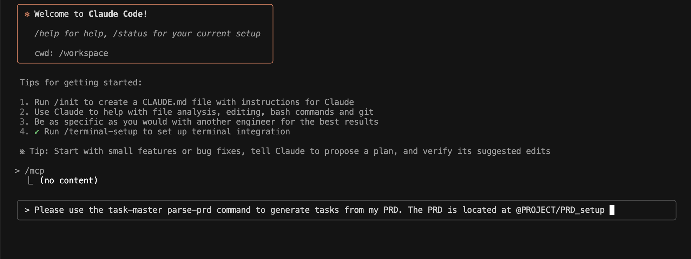

## 🚀 Jumpstart Your Next Project with Our Dev Container: AI-Ready, Database-Ready, and Zero Hassle

Hey folks! 👋

Ever wish you could just *open a project and start building*—no more fighting with Node versions, database configs, or missing CLI tools? That’s exactly what this dev container is all about. Whether you’re a solo hacker or part of a team, this setup gets you coding in minutes, not hours.

I put a repo you can use for that, check it out here [https://github.com/jgonzalezd/Node-Claude-Devcontainer](https://github.com/jgonzalezd/Node-Claude-Devcontainer)

### 🛠️ What’s Inside?

- **Ubuntu 22.04**: Stable, modern, and ready for anything.
- **PostgreSQL**: Pre-installed, pre-configured, and running out of the box. No more “can’t connect to database” headaches.
- **Node.js 20**: Managed with NVM, so you’re always on the right version.
- **Python 3**: For those quick scripts or data wrangling tasks.
- **VS Code Extensions**: Prettier, TypeScript Next, YAML tools, and more—so your editor just works.
- **Claude Code CLI + MCPs**: This is where the magic happens (more on this below!).

### 🧑‍💻 Getting Started is Stupid Simple

1. **Open in VS Code**  
   Just open the project folder and hit “Reopen in Container” when prompted. Or run the “Remote-Containers: Reopen in Container” command.

2. **Wait a Minute**  
   The container builds, sets up PostgreSQL, installs all the tools, and configures your environment. Go grab a coffee ☕.

3. **You’re Ready!**  
   - Database is running (user: `vscode`, password: `password`)
   - Node and Python are set up
   - All the right VS Code extensions are enabled
   - Claude Code CLI and MCPs are installed

### 🤖 What’s the Deal with Claude Code and MCPs?

**Claude Code CLI** is your AI coding sidekick. It’s like having a super-powered pair programmer who never sleeps. But what really makes it shine here is the **MCPs** (Multi-Context Providers).

#### So… What Are MCPs?

Think of MCPs as “AI plugins” that let Claude Code tap into different sources of context, knowledge, or automation. In this container, you get:

- **Task Master AI**: For managing todos, tracking progress, and keeping your workflow organized. [Check out how to use it here](https://github.com/eyaltoledano/claude-task-master/blob/main/docs/tutorial.md#initial-task-generation)
- **Context7 MCP**: For deep code understanding, context-aware suggestions, and smarter code navigation.

With these MCPs, Claude Code can:
- Help you understand unfamiliar codebases
- Suggest next steps or improvements
- Automate repetitive tasks
- Keep your project organized with AI-powered task management

All of this is pre-installed and ready to go. No npm install dance, no API key wrangling, no config file spelunking.

### 🏁 Why Use This Setup?

- **Zero config**: Everything just works, right out of the box.
- **AI superpowers**: Claude Code + MCPs = next-level productivity.
- **Team-friendly**: Everyone gets the same environment, so “it works on my machine” is a thing of the past.
- **Easy database access**: PostgreSQL is ready for your app, your tests, and your experiments.

### 🧪 Try It Out!

- Open a terminal and run `claude` to login to the CLI.
- Use `claude mcp list` to see your available MCPs.
- Start coding, and let Claude help you with code suggestions, explanations, and task management.
- Use the Task Master:
{: width="750" }

### 🛟 Troubleshooting?

- Database not running? `sudo service postgresql restart`
- Node not found? `source ~/.bashrc`
- Claude CLI acting up?  
  ```